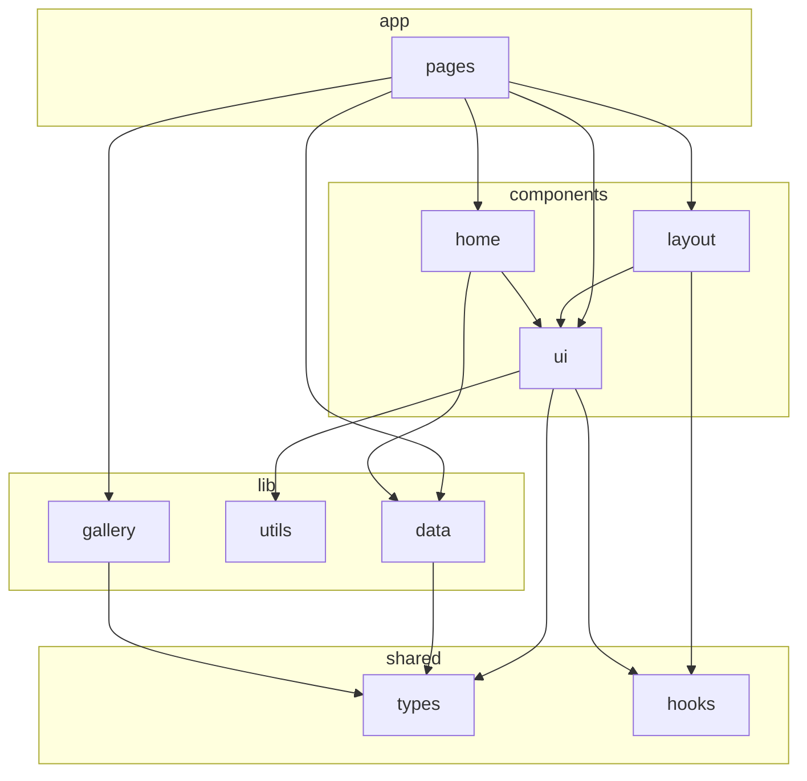

# Next.js 项目架构优化计划

## 一、当前问题概览

| 问题 | 现状 |

|------|------|

| 嵌套重复项目 | 根目录下存在 [elderstech/elderstech](elderstech/) 完整 Next 工程，与根项目重复 |

| 组件层级混乱 | [components/](components/) 根目录混放布局组件（BackLink、ThemeProvider、ThemeToggle）、业务组件；[components/ui/](components/ui/) 内 30+ 文件平铺，既有基础 UI（button/card）又有复杂特性（animated-*、interactive-bento-gallery） |

| 类型与数据依赖方向不当 | [lib/gallery.ts](lib/gallery.ts) 从 `@/components/ui/interactive-bento-gallery.types` 引用类型，lib 依赖 components |

| 单一大数据文件 | [lib/data.ts](lib/data.ts) 400+ 行，混合 site、timeline、about、activity、stats、nav、team、footer 等所有业务数据 |

| Hooks 分散 | 有 [components/hooks/use-debounced-dimensions.ts](components/hooks/use-debounced-dimensions.ts)，又有 [components/ui/use-scroll.tsx](components/ui/use-scroll.tsx)，hooks 与 UI 混放 |

| 未使用组件 | [components/FloatingCanvas.tsx](components/FloatingCanvas.tsx) 未被任何文件引用 |

---

## 二、目标目录结构（推荐）

```
elderstech/
├── app/                          # 保持现有路由，可选增强
│   ├── (marketing)/              # 可选：首页等营销路由组
│   │   └── page.tsx
│   ├── activity/, gallery/, records/, reflection/, results/, team/
│   ├── layout.tsx, page.tsx, globals.css
├── components/
│   ├── layout/                   # 新建：全局布局相关
│   │   ├── header.tsx
│   │   ├── back-link.tsx
│   │   ├── theme-provider.tsx
│   │   └── theme-toggle.tsx
│   ├── ui/                       # 仅保留基础/通用 UI 与明确分组
│   │   ├── button.tsx, card.tsx, badge.tsx
│   │   ├── about/                # 保持
│   │   ├── highlighter/          # 保持
│   │   ├── radial-orbital/       # 保持
│   │   ├── scroll-expansion/     # 保持
│   │   ├── animated/             # 新建：归并 animated-* 组件
│   │   ├── gallery/              # 新建：interactive-bento-gallery 等
│   │   └── index.ts              # 可选：ui 对外 barrel
│   ├── home/                     # 保持：首页区块
│   └── ...
├── hooks/                        # 新建：根级 hooks
│   ├── use-debounced-dimensions.ts
│   ├── use-scroll.ts
│   └── index.ts
├── lib/
│   ├── utils.ts                  # 保持
│   ├── data/                     # 新建：拆分 data.ts
│   │   ├── index.ts              # 统一 re-export，保证现有 import 兼容
│   │   ├── site.ts
│   │   ├── timeline.ts
│   │   ├── about.ts
│   │   ├── activity.ts
│   │   ├── stats.ts
│   │   ├── nav.ts
│   │   ├── team.ts
│   │   └── footer.ts
│   └── gallery.ts                # 保持，改为从 @/types 引用类型
├── types/                        # 新建：共享类型
│   ├── index.ts
│   ├── gallery.ts                # MediaItemType 等
│   └── team.ts                   # TeamMember（从 lib/data 迁出）
├── docs/                         # 保持
└── elderstech/                   # 建议删除或移出仓库
```

---

## 三、具体改动项

### 1. 清理与冗余

- **elderstech/elderstech**：确认为模板或旧拷贝后，从仓库中删除或移出（如 `templates/` 或单独仓库），避免与根项目混淆。
- **FloatingCanvas**：当前未被引用，可删除或移至 `components/demo/` 等占位目录，并在计划中注明。

### 2. 新建 `types/` 并统一类型来源

- 新建 [types/](types/) 目录。
- 将 `MediaItemType` 从 [components/ui/interactive-bento-gallery.types.ts](components/ui/interactive-bento-gallery.types.ts) 迁至 `types/gallery.ts`（或 `types/index.ts`），供 [lib/gallery.ts](lib/gallery.ts) 与 gallery 相关组件引用。
- 将 `TeamMember` 从 [lib/data.ts](lib/data.ts) 迁至 `types/team.ts`，[lib/data/team.ts](lib/data/team.ts) 与页面从 `@/types` 引用。
- 保留组件内部独用类型：如 [components/ui/about/types.ts](components/ui/about/types.ts)、[components/ui/radial-orbital/types.ts](components/ui/radial-orbital/types.ts) 仍放在各自组件目录；仅“被 lib 或跨模块使用”的类型上提到 `types/`。

**依赖方向**：`app` → `components` / `lib`；`lib` → `types`；`components` → `types` / `lib/utils`；禁止 `lib` → `components`。

### 3. 新建 `components/layout/`

- 新建 [components/layout/](components/layout/)。
- 将 [components/ui/header.tsx](components/ui/header.tsx) 移入并重命名为 `header.tsx`（或保持 `header.tsx`）。
- 将 [components/BackLink.tsx](components/BackLink.tsx) → `components/layout/back-link.tsx`。
- 将 [components/ThemeProvider.tsx](components/ThemeProvider.tsx) → `components/layout/theme-provider.tsx`。
- 将 [components/ThemeToggle.tsx](components/ThemeToggle.tsx) → `components/layout/theme-toggle.tsx`。
- 全局替换引用路径：`@/components/BackLink` → `@/components/layout/back-link`，`@/components/ThemeProvider` → `@/components/layout/theme-provider`，`@/components/ThemeToggle` → `@/components/layout/theme-toggle`，`@/components/ui/header` → `@/components/layout/header`（或新路径）。

### 4. 重组 `components/ui/`

- **保留为扁平或已有子目录**：`button`、`card`、`badge`、`about/`、`highlighter/`、`radial-orbital/`、`scroll-expansion/`。
- **新建 `components/ui/animated/`**：将 `animated-feature-carousel.tsx`、`animated-gradient-with-svg.tsx`、`animated-roadmap.tsx`、`animated-tooltip.tsx` 等移入，并更新所有 import（如 [components/home/](components/home/) 与 [app/](app/) 中的引用）。
- **新建 `components/ui/gallery/`**：将 `interactive-bento-gallery.tsx`、`interactive-bento-gallery-media.tsx`、`interactive-bento-gallery-modal.tsx`、`interactive-bento-gallery.types.ts`（类型迁出后此文件可删除或仅 re-export 类型）以及 `arc-gallery-hero-component.tsx`、`interactive-selector.tsx` 等与 gallery 强相关的移入，并更新 [app/gallery/page.tsx](app/gallery/page.tsx) 及内部相互引用。
- **其余 UI**：如 `aurora-background`、`gooey-text-morphing`、`magnetize-button`、`menu-toggle-icon`、`shiny-button`、`typewriter`、`wave-text`、`use-scroll`（见下）等，可暂时保留在 `ui/` 根下，或按“动画/特效”“导航”等再细分子目录（可选）。
- **header**：已迁到 `components/layout/`，从 `ui/` 中删除。

### 5. 根级 `hooks/`

- 新建 [hooks/](hooks/) 目录。
- 将 [components/hooks/use-debounced-dimensions.ts](components/hooks/use-debounced-dimensions.ts) 移至 `hooks/use-debounced-dimensions.ts`。
- 将 [components/ui/use-scroll.tsx](components/ui/use-scroll.tsx) 移至 `hooks/use-scroll.ts`（仅保留 hook，扩展名可为 `.ts`）。
- 在 `hooks/index.ts` 中 re-export 上述 hooks。
- 更新引用：如 [components/ui/animated-gradient-with-svg.tsx](components/ui/animated-gradient-with-svg.tsx) 中的 `@/components/hooks/use-debounced-dimensions` → `@/hooks`；[components/layout/header.tsx](components/ui/header.tsx) 中的 `@/components/ui/use-scroll` → `@/hooks/use-scroll`。
- 删除空的 `components/hooks/` 与 `components/ui/use-scroll.tsx`。

### 6. 拆分 `lib/data.ts` 为 `lib/data/` 多文件

- 新建 [lib/data/](lib/data/) 目录。
- 按领域拆分为：`site.ts`、`timeline.ts`、`about.ts`、`activity.ts`、`stats.ts`、`nav.ts`、`team.ts`、`footer.ts`。将 [lib/data.ts](lib/data.ts) 中对应常量与 `TeamMember` 类型（类型迁至 `types/team.ts`）分别移入。
- 在 `lib/data/index.ts` 中统一 `export * from './site'` 等，保持对外 API 与现有 `import { site, timelinePhases, ... } from '@/lib/data'` 兼容。
- 删除原 `lib/data.ts`，并将原 `from '@/lib/data'` 的引用改为 `from '@/lib/data'`（路径不变，仅指向新 index）。

### 7. 修正 `lib/gallery.ts` 的类型引用

- [lib/gallery.ts](lib/gallery.ts) 改为从 `@/types`（或 `@/types/gallery`）导入 `MediaItemType`，不再从 `@/components/ui/interactive-bento-gallery.types` 导入。

### 8. 命名与导出约定（建议）

- **文件命名**：新文件与移动文件统一使用 **kebab-case**（如 `back-link.tsx`、`theme-provider.tsx`），与现有 `ui/` 内多数文件一致。
- **组件导出**：重要入口可提供 barrel（如 `components/ui/index.ts`、`hooks/index.ts`、`lib/data/index.ts`），避免深层路径扩散；页面与业务组件优先从 barrel 或明确目录导入。

### 9. App 层可选增强（低优先级）

- 若需按“营销页 / 内容页”区分布局，可引入路由组：如 `app/(marketing)/page.tsx`、`app/(content)/team/page.tsx` 等，便于后续为不同组设置不同 layout。
- 为关键路由添加 `loading.tsx` / `error.tsx`（如 [app/gallery/page.tsx](app/gallery/page.tsx)、[app/team/page.tsx](app/team/page.tsx)）以提升体验。

---

## 四、依赖关系（优化后）



---

## 五、实施顺序建议

1. 新建 `types/`，迁移 `MediaItemType`、`TeamMember`，并更新 `lib/gallery.ts` 与将建的 `lib/data/team.ts` 的引用。
2. 新建 `lib/data/` 并拆分 `data.ts`，保留 `lib/data/index.ts` 兼容现有 import。
3. 新建 `hooks/`，迁移两个 hook，更新所有引用并删除旧文件。
4. 新建 `components/layout/`，迁移 header、BackLink、ThemeProvider、ThemeToggle，更新全局 import。
5. 新建 `components/ui/animated/`、`components/ui/gallery/`，迁移对应文件并更新 import。
6. 删除或移出 `elderstech/elderstech`，处理未使用的 `FloatingCanvas`。
7. （可选）为 app 增加路由组或 loading/error 文件。

按上述顺序执行可最大程度保持“一次只改一类引用”，便于分步提交与回归测试。